# AgriTrust

> A negotiation-focused agricultural marketplace for smallholder farmers.

**Repository:** [github.com/emmanuelnyadongo/agritrust-connect](https://github.com/emmanuelnyadongo/agritrust-connect)

---

## Description

**AgriTrust** is a B2B web application designed to support fairer price negotiation between smallholder farmers and produce buyers in Zimbabwe.

Most digital agriculture platforms focus on access or aggregation. AgriTrust focuses on **the negotiation moment**—introducing data-informed price guidance directly into buyer–farmer discussions while keeping final decisions in human hands.

- The system **does not** fix prices.
- The system **does not** replace intermediaries.
- The system **supports** informed negotiation.

---

## The Problem

Smallholder farmers often negotiate under pressure. Buyers usually have better information about:

- Current market prices
- Demand levels
- Alternative supply sources

Farmers, especially when dealing with perishable goods, are forced to accept unfavourable prices due to information imbalance and urgency.

Existing digital platforms either **centralise pricing authority** or **provide price information outside the transaction flow**. In both cases, farmers remain price takers.

---

## What AgriTrust Does Differently

AgriTrust embeds negotiation support into the transaction itself.

| Instead of… | The system provides… |
|-------------|-------------------------|
| Static price lists | Real-time market price ranges |
| Informal off-platform bargaining | Contextual price recommendations |
| — | Transparent reasoning behind guidance |

Negotiation remains between people. The system acts as an **evidence layer**.

---

## How to Set Up the Environment and the Project

### Prerequisites

- [Node.js](https://nodejs.org/) (v18 or later recommended)
- [npm](https://www.npmjs.com/) or [Bun](https://bun.sh/)
- A [Supabase](https://supabase.com/) project (for backend)

### 1. Clone the repository

```bash
git clone https://github.com/emmanuelnyadongo/agritrust-connect.git
cd agritrust-connect
```

### 2. Install dependencies

```bash
npm install
```

### 3. Environment variables

Create a `.env` or `.env.local` in the project root with:

```env
VITE_SUPABASE_URL=your_supabase_project_url
VITE_SUPABASE_ANON_KEY=your_supabase_anon_key
```

Get these from your [Supabase project](https://app.supabase.com) → **Settings** → **API**.

### 4. Set up the database (Supabase)

In the [Supabase SQL Editor](https://app.supabase.com/project/_/sql), run in order:

1. `supabase/schema.sql` — tables, indexes, triggers  
2. `supabase/policies.sql` — row level security policies  

### 5. Run the app locally

```bash
npm run dev
```

Open [http://localhost:8080](http://localhost:8080) in your browser.

---

## Designs

### Screenshots

Screenshots of the AgriTrust application across mobile, tablet, and desktop views:

#### Desktop Views

<details>
<summary><strong>Authentication & Entry</strong></summary>

**Sign-in Page**


The sign-in interface with role selection (Farmer/Buyer), email/password fields, and platform information.

</details>

<details>
<summary><strong>Marketplace</strong></summary>

**Available Produce**
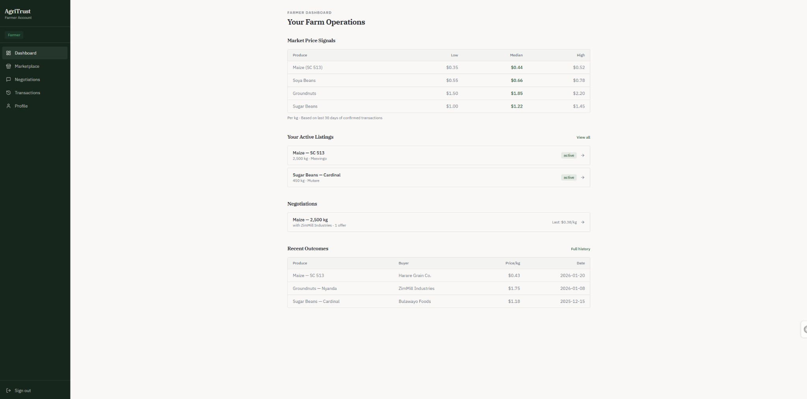

Browse available produce with search, region filters, and detailed listings showing farmer ratings, quantities, prices, and market ranges.

</details>

<details>
<summary><strong>Negotiations</strong></summary>

**Active Negotiations**
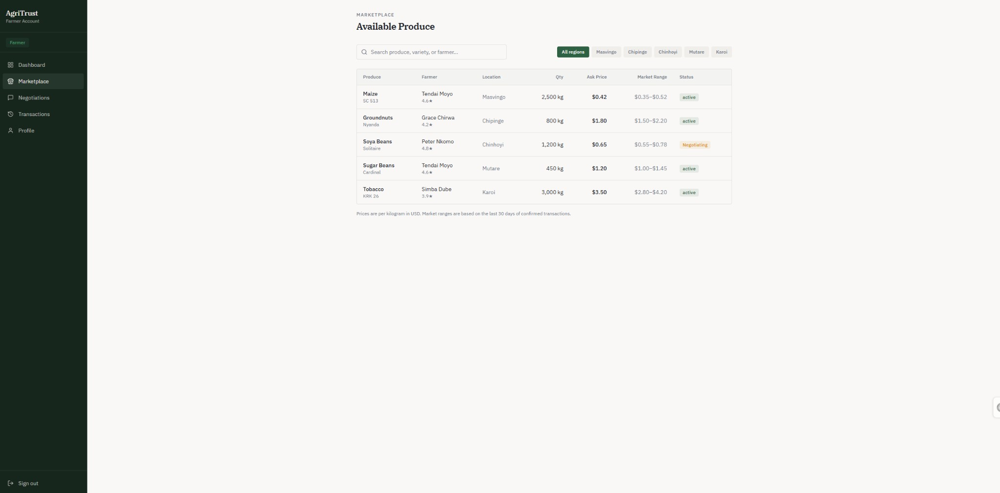

View active negotiations with current prices, system guidance, and offer counts.

</details>

<details>
<summary><strong>Transactions</strong></summary>

**Transaction History**
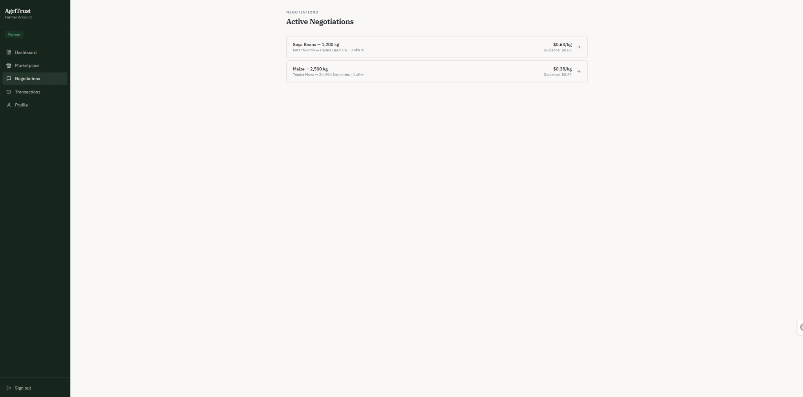

Complete transaction records with dates, produce details, parties, agreed prices, and status indicators.

</details>

<details>
<summary><strong>Profile</strong></summary>

**User Profile**
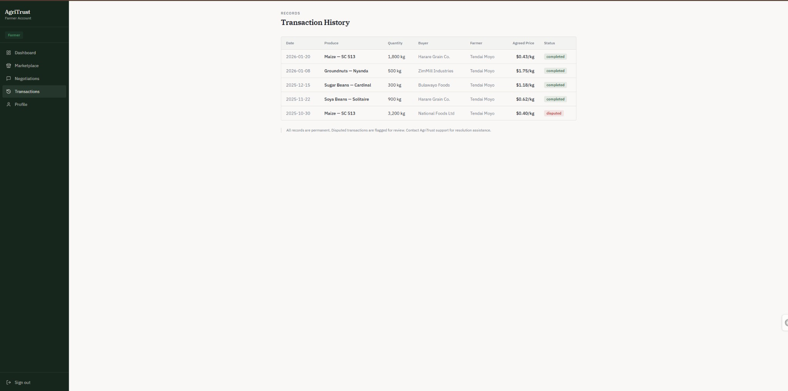

User profile showing identity, activity summary, trust score, and consistency indicators.

</details>

<details>
<summary><strong>Dashboard</strong></summary>

**Farmer Dashboard**
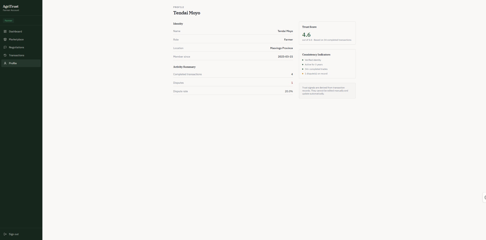

Farmer dashboard with market price signals, active listings, negotiations, and recent transaction outcomes.

</details>

#### Mobile & Tablet Views

<details>
<summary><strong>Mobile Authentication</strong></summary>

**Sign-in (Mobile)**
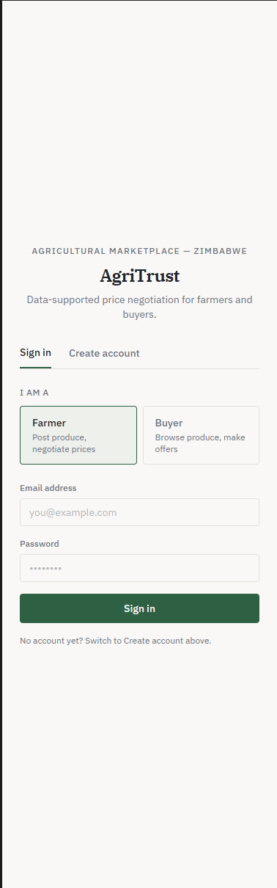

Mobile-optimized sign-in interface with role selection and form fields.

</details>

<details>
<summary><strong>Mobile Marketplace</strong></summary>

**Available Produce (Mobile)**
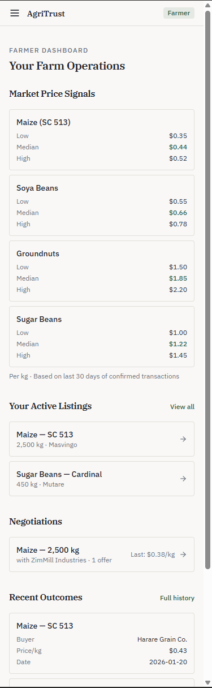

Mobile marketplace view with card-based listings, search, and region filters.

</details>

<details>
<summary><strong>Mobile Negotiations</strong></summary>

**Active Negotiations (Mobile)**
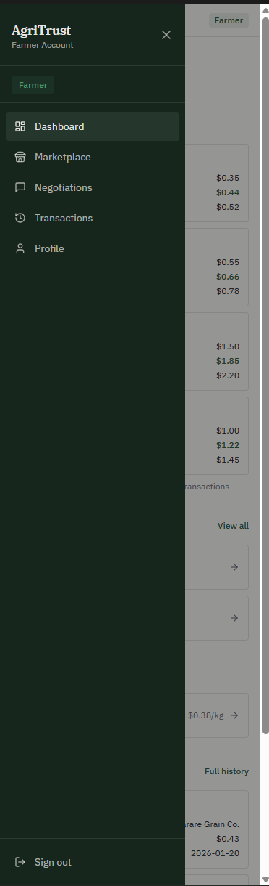

Mobile view of active negotiations with compact card layout.

</details>

<details>
<summary><strong>Mobile Transactions</strong></summary>

**Transaction History (Mobile)**
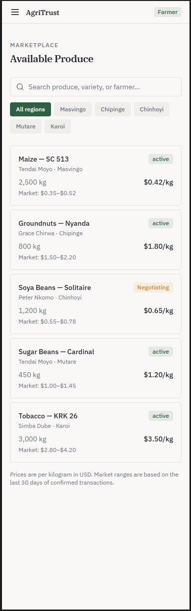

Mobile transaction history with scrollable card-based layout and status indicators.

</details>

<details>
<summary><strong>Mobile Profile</strong></summary>

**Profile (Mobile)**
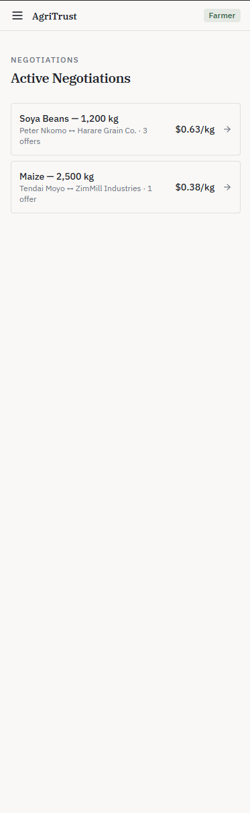

Mobile profile view with identity, activity summary, and trust score.

</details>

<details>
<summary><strong>Mobile Dashboard</strong></summary>

**Farmer Dashboard (Mobile)**
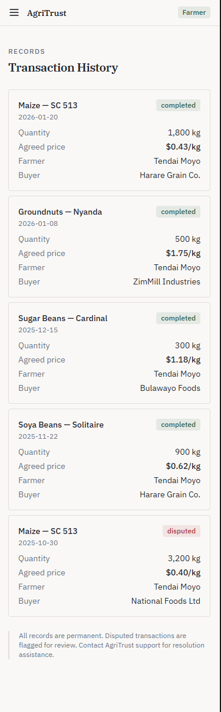

Mobile dashboard with market signals, listings, and recent outcomes.

**Navigation Sidebar (Mobile)**
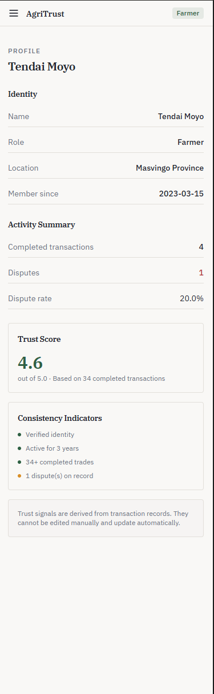

Mobile navigation drawer with menu items and sign-out option.

</details>

### Additional Design Resources
 
- **Architecture diagram:** See [Backend Architecture](docs/BACKEND.md) for frontend ↔ Supabase flow diagram.

---

## Deployment Plan

| Component        | Approach |
|-----------------|----------|
| **Frontend**    | Build the React app (`npm run build`) and deploy the `dist/` output to a static host (e.g. [Vercel](https://vercel.com), [Netlify](https://netlify.com), or GitHub Pages). Set `VITE_SUPABASE_URL` and `VITE_SUPABASE_ANON_KEY` in the host’s environment. |
| **Backend**     | Supabase hosts the database, Auth, and APIs. No separate server to deploy. Run `schema.sql` and `policies.sql` in the Supabase project used for production. |
| **Environment**  | Use the same Supabase project for production or create a dedicated one; point the production frontend env vars to that project’s URL and anon key. |

---

## Core Concepts

| Principle | Meaning |
|-----------|---------|
| **Negotiation over automation** | The platform assists decision-making rather than replacing it. |
| **Transparency over optimisation** | Users see why price guidance exists, not just the result. |
| **Agency over control** | Farmers and buyers retain full authority over outcomes. |
| **Trust over growth metrics** | Design prioritises traceability, consistency, and accountability. |

---

## Key Features

### Produce Marketplace

- Structured produce discovery
- Contextual information over visual tiles
- Emphasis on quantity, timing, and location

### Assisted Negotiation Room

- Clear offer history
- Side-by-side price comparison
- System-generated price guidance with explanation
- No chat-style negotiation UI

### Market Price Analytics

- Historical and reference price ranges
- Used to inform, not enforce, negotiation

### Transaction Records

- Traceable and auditable transaction history
- Designed for accountability rather than engagement

### Role-Based Dashboards

- **Farmer:** Listings and negotiations
- **Buyer:** Availability and market context

---

## User Roles

### Farmer

- Create and manage produce listings
- Enter negotiations with buyers
- View price guidance during negotiation
- Review past transaction outcomes

### Buyer

- Discover available produce
- Initiate and participate in negotiations
- View market context during price discussion
- Maintain transaction records

---

## User Flow Overview

1. Farmer posts produce with quantity and availability details.
2. Buyer discovers produce via the marketplace.
3. Buyer initiates negotiation.
4. System provides price guidance based on market data.
5. Users exchange offers.
6. Agreement is reached or negotiation ends.
7. Transaction is recorded for traceability.

The flow avoids forced steps and allows natural movement between actions.

---

## Tech Stack

### Frontend

- **React** · **JavaScript**
- Component-based architecture
- Mobile-first responsive design

### Backend (Planned)

- **Supabase** · **PostgreSQL**
- Authentication and role management
- Real-time updates
- Serverless functions for analytics and negotiation logic

**Backend architecture and design** are documented in **[docs/BACKEND.md](docs/BACKEND.md)** (Supabase, schema, RLS, API usage, deployment).

---

## Project Structure

The frontend is organised to support backend integration later.

```
src/
├── components/
│   ├── navigation/
│   ├── listings/
│   ├── negotiation/
│   ├── analytics/
│   └── feedback/
├── pages/
│   ├── dashboard/
│   ├── marketplace/
│   ├── listing-detail/
│   ├── negotiation-room/
│   ├── transactions/
│   └── profile/
├── layouts/
├── hooks/
└── utils/
```

This structure supports modular growth and clean API integration.

---

## Design Principles

- **Calm, non-flashy interface** — Green-focused palette without gradients.
- **Asymmetrical layouts** — To avoid generic SaaS patterns.
- **Content-driven structure** — Rather than marketing sections.

The UI is designed to feel closer to a cooperative or market board than a startup landing page.

---

## Project Status

This repository currently focuses on:

- Frontend UI and UX design
- Component architecture
- User flow modelling

Backend integration will be added in later phases.

---

## Motivation

This project is part of a **final-year software engineering capstone** and an applied research effort into negotiation support systems in smallholder agriculture.

> The goal is not scale at all costs.  
> The goal is **feasibility**, **fairness**, and **evidence**.
